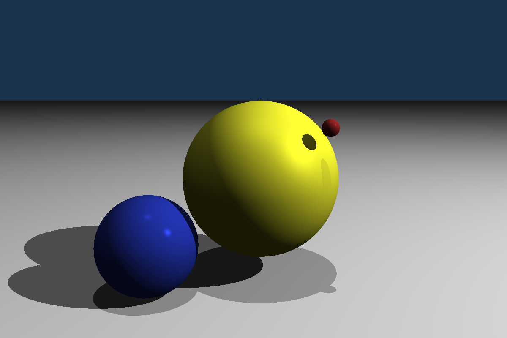

# Photorealistic-Graphics-Summer-semester-2023
---
The ray tracer implementation for the course Photorealistic Graphics at Charles University summer sememster 2023 by Hegyi Gáspár András. Solution is in the src/004 folder. 

# Basic functionality, and usage
---
The program generates an image with a circle inside with the diameter of the size of the shorter side, and interpolates between 2 colors inside 
the circle with the pixel height.  

It generates another image based on path tracing, which is saved as PathTrace.pfm . The initial image can be modified from the config file. The default image has the same scene properties as the sample image for checkpoint 8. The reason the image is flipped is probably caused by how I use the coordinate systems. The default path traced image is below. 



Right now modification of the scene is only possible through the config file, I plan to make modification available through
the command line later.  

## The config file
The config file is a json file, its contents are serialized into classes that have the same properties as in the
config file.  

__GeneralConfig__: The general config contains values for the demo pfm image, these are the two colors it interpolates through,
and the name of the saved file.
  
__CameraConfig__: The camera config allows defining camera attributes. These are the position of 
the camera in the world, and a target the camera os looking at. These two parametrs define the camera's orientation
in the scene. The last parameter is the field of view.  

__SceneConfig__: The scene config first declares the up direction in the world (this might be moved to the code as a constant scnen property, 
sonce there is no need to change this). Next up is the definition of the objects that are making up the scene.
Objects are the solids in the scene, and they can be put under the "Objects" field. Currently there are two 
solids implemented, sphere, and infinite plane. Since both have different parameters that define them, they 
can be found with different fields under the object. Below is an example of putting one sphere, and one plane in the scene. 

```json
"Objects": {
      "Spheres": {
        "Number": 1,
        "Positions": [
          [ 0, 1, 0 ],
        ],
        "Colors": [
          [ 20, 20, 120 ],
        ],
        "Materials": [
          [ 0.2, 0.8, 0.2, 100 ],
        ],
        "Radiuses": [1]
      },
      "Planes": {
        "Number": 1,
        "Normals": [
          [ 0, 0, 1 ],
        ],
        "Positions": [
          [ 0, 0, -4 ],
        ],
        "Colors": [
          [ 230, 230, 230 ],
        ],
        "Materials": [
          [ 0.5, 0.95, 0.5, 150 ],
        ]
      }
    }, 
```
The number defines how many of the defined objects will be displayed. If the number is not the same as the positions, a warning is 
logged, in case leaving out objects was not our intention. Most of the attributes will be descibed later in more detail. Right now the only available material is
phong reflection model. The way materials are assigned to an object will be modified when the  Another oject can be added, if we increase the number, and add the next object's attributes to the corresponding fields.  

The light configurations are defined in a similar way.
```json
   "AmbientLighting": [ 1, 1, 1 ],
    "Lightings": {
      "PointLights": {
        "Number": 2,
        "Positions": [
          [ -10, 8, -6 ],
          [ 1, 1, 1 ]
        ],
        "SpecularIntensities": [
          [ 1, 1, 1 ],
          [ 0.3, 0.3, 0.3 ]
        ],
        "DiffuseIntensities": [
          [ 1, 1, 1 ],
          [ 0.3, 0.3, 0.3 ]
        ]
      },
      "DirectionalLights": {
        "Number": 0,
        "Directions": [],
        "SpecularIntensities": [],
        "DiffureIntensities": []
      }
```
__PlaneConfig__: The plane config has only 2 fields, which are the width and height.  
## Arguments 
The program currently accepts 5 arguments, which are the following:
- width: int
- height: int
- filename: string
- start color: hex, First color in the interpolation
- max color: hex, Second color in the interpolation

Command line arguments are given values with the "=" sign.  
An example command-line argument can be the following:  width=600 height=450 file_name=demo.pfm color1=000000 color2=FFFFFF


# Architecture
---
Here is a brief description of how the command line application works. Besides I made a doxygen documentation for the classes, it will be uploaded when I finish all the XML commenting.
 ## Config classes
 The config classes have the same structure as the json file. In addition the SceneConfig has an Init method, that creates the 
 objects that are part of the scene, and when the class Config is created the Init method is called. This way, when the scene is initialized 
 from the config file, the Scene's constructor just adds the created objects to the scene.
 ## Scene
 In this part the scene class, and all of the elements that can be added to the scene are described (will be described).
 ## Shading
 The shading module has two main components. One is the ReflecteceFunction abstract class. The classes that implement this
 define a function that describes how the light is reflected on the surface of the object. Right now Phong reflectance model is the only one available.  

 The other part is the different materials. They are not used in the code, since the only shading is the Phong model, and the material's parameters can be 
 set in the config file, which are the parameters for the Phong reflection.
 ## Utils

# Future plans, and some faulty behaviours.
This is a list of things that are planned to be implemented, and sbehaviours that should be solved.  
- One not solved behaviour is if the camera is facing away from the scene, the intersection are 
still calculated, and it creates a flipped image along both axes. This can be solved, if the intersection functions are not allowed return negative values. 
