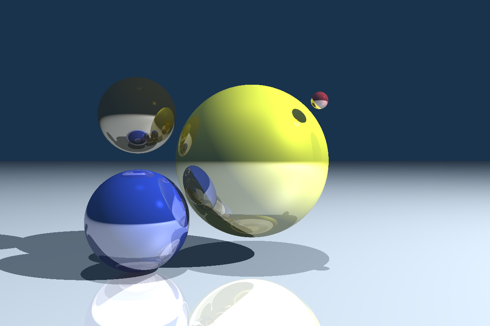
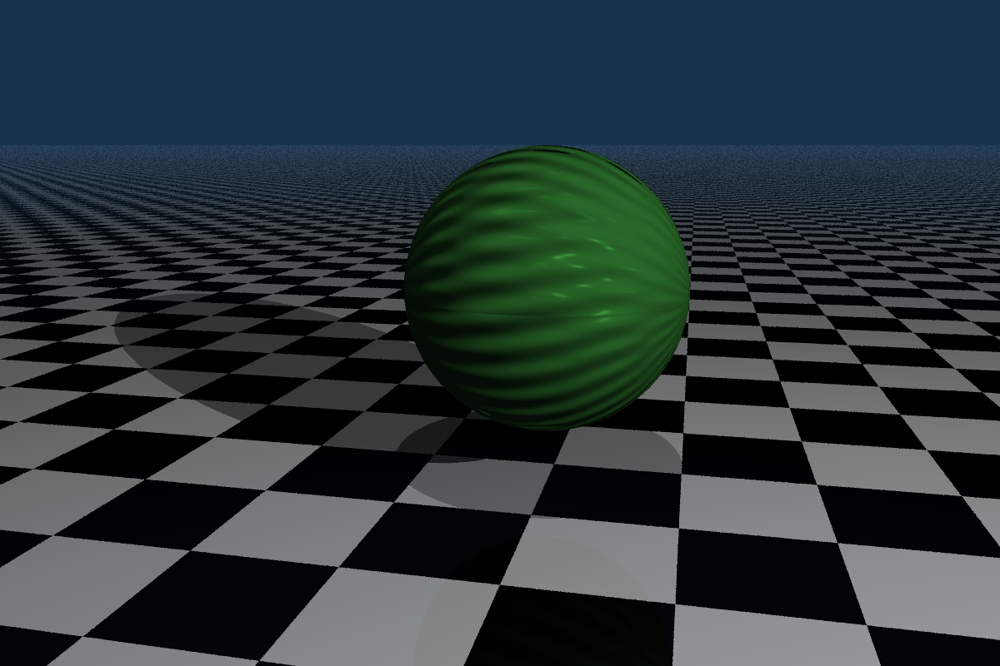
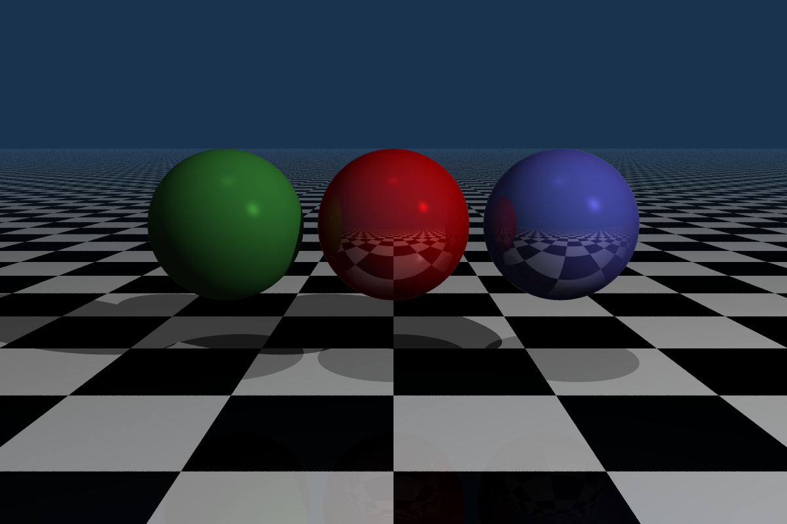
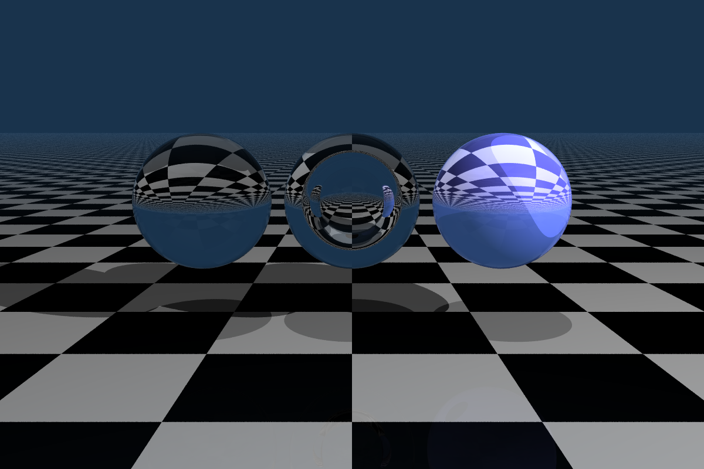
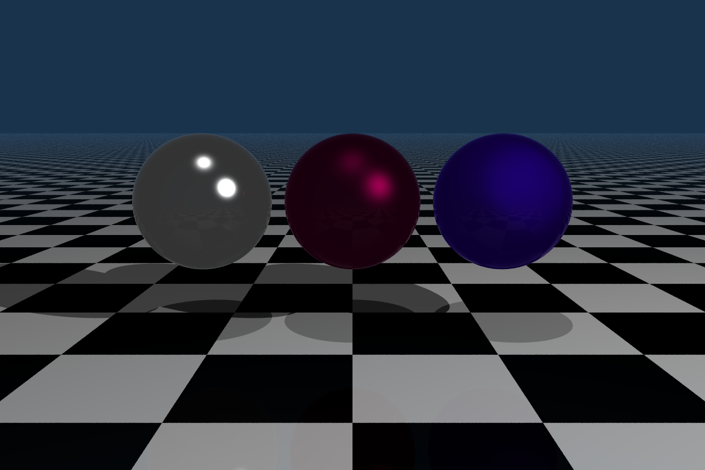
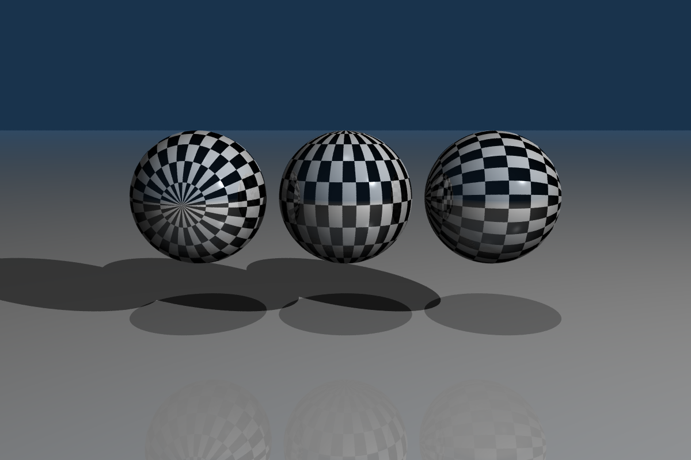
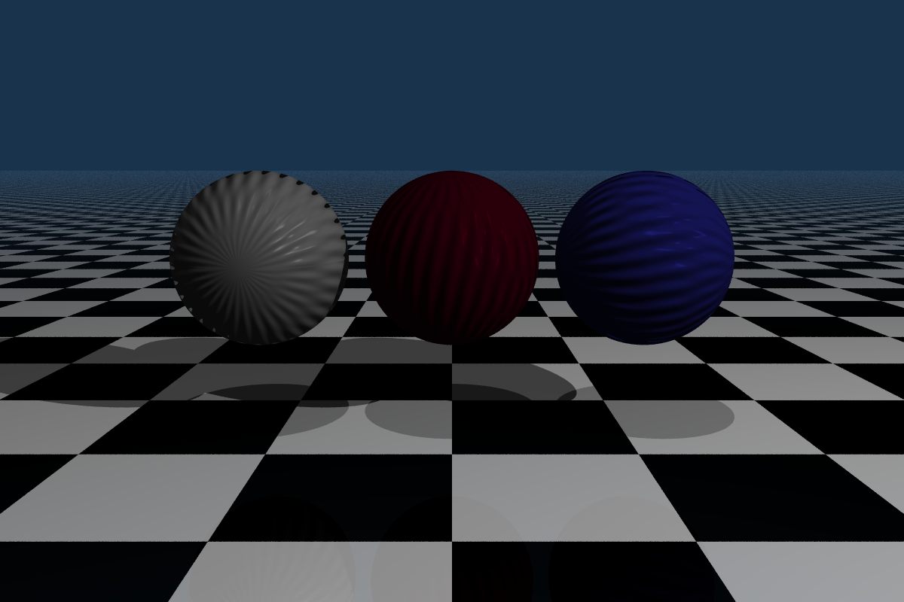

# Photorealistic-Graphics-Summer-semester-2023
---
The ray tracer implementation for the course Photorealistic Graphics at Charles University summer sememster 2023 by Hegyi Gáspár András. Solution is in the src/004 folder. 

# Basic functionality, and usage
---
The program generates an image with a circle inside with the diameter of the size of the shorter side, and interpolates between 2 colors inside 
the circle with the pixel height.  

It generates another image based on path tracing, which is saved as PathTrace.pfm . The initial image can be modified from the config file. 



## The config files
The config file is a json file, its contents are serialized into classes that have the same properties as in the
config file.  

__GeneralConfig__: The general config contains values for the demo pfm image, these are the two colors it interpolates through,
and the name of the saved file. The file extension is not needed. The last parameter is whether to run in parallel or not. The 
execution time of the ray tracer is logged. 
  
__CameraConfig__: The camera config allows defining camera attributes. These are the position of 
the camera in the world, and a target the camera os looking at. These two parametrs define the camera's orientation
in the scene. The last parameter is the field of view.  

__SceneConfig__: The scene config first declares the up direction in the world (this might be moved to the code as a constant scene property, 
since there is no need to change this). Shadows, backgroung color, maximum recursion depth, and the scene definition can also be set up here, the latter
by specifying the .json file describing the scene (described later).  

Besides these, the light sources can also be added to the scene. Te directional, and point lights are defined separately. 
Directional lights however are not implemented yet. However the field is needed in the config, otherwise the program exits because
the config is not initialized correctly, and the program exits.  

Below is an example json syntax for the scene config.
```json
   "SceneConfig": {
    "WorldUpDirection": [ 0, 1, 0 ],
    "Shadows": true,
    "BackgroundColor": [ 0.1, 0.2, 0.3 ],
    "MaxDepth": 4,
    "SceneGraph": "SceneGraph.json",
    "AmbientLighting": [ 1, 1, 1 ],
    "Lightings": {
      "PointLights": {
        "Number": 2,
        "Positions": [
          [ -10, 8, -6 ],
          [ 0, 20, -3 ]
          
        ],
        "SpecularIntensities": [
          [ 1, 1, 1 ],
          [ 0.3, 0.3, 0.3 ]
          
        ],
        "DiffuseIntensities": [
          [ 1, 1, 1 ],
          [ 0.3, 0.3, 0.3 ]
          
        ]
      },
      "DirectionalLights": {
        "Number": 0,
        "Directions": [],
        "SpecularIntensities": [],
        "DiffureIntensities": []
      }
    }
  },
```
__PlaneConfig__: The plane config defines the width and height in pixels, and the number of rays per pixel.  
  
Command line arguments are given values with the "=" sign.  
An example command-line argument can be the following:  width=600 height=450 file_name=demo.pfm color1=000000 color2=FFFFFF
  
__Scene Definition__: The objects can be added from the SceneTree.json config file, which uses the hierarchical structure of json to define a tree. 
Each node can contain a transformation field, attributes, children, and the object. The objects are added with their class 
name e.g.: "Obj":"Sphere". Transformation can be 4 things, translation, and rotations are defined separately for each
axes. The syntax for translation: `"Transformation":"translate(0,2,0)"`. The translation is done relative to the 
current position. The rotation are defined with the keywords `rotationX`,`rotationY`, and `rotationZ`, and they accept 
the angle in degrees as argument in brackets. Multiple transformations can be defined in one field, separated with a space.
Angles are used because its easier to write to a string than radians. Attributes
is a field with brackets, below is and example of it. It contains color, scale, texture, and the material of the 
objects.
```json
 "Attributes": {
        "Clr": [ 0.2, 0.5, 0.2 ],
        "Mat": "Phong3",
        "Scale": 1,
        "Txt": "SinCosBumpMap"
      }
```

The children field is just a list, that conatains the child nodes. The transfrmations, and attributes are inherited down the 
tree i.e: every leaf node's objects undergo all tranfromations along the way. Objects can be placed to inner nodes as well, not just
leaf nodes. If the object is put to a node that defines attributes and transformations those will affect the object. An example 
scene tree, and the scene generated is shown below.
```json
{
  "Children": [
    {
      "Transformation": "rotateX(90) translate(2,0,-2) rotateY(90) translate(0,2,3)",
      "Attributes": {
        "Clr": [ 0.2, 0.5, 0.2 ],
        "Mat": "Phong3",
        "Scale": 2,
        "Txt": "SinCosBumpMap"
      },
      "Obj": "Sphere"
    },
    {
      "Transformation": "translate(0,-1,0)",
      "Attributes": {
        "Clr": [ 0.9, 0.9, 0.9 ],
        "Mat": "Phong2",
        "Scale": 1,
        "Txt": "CheckerBoard"
      },
      "Children": [
        {
          "Obj": "Plane"
        }
      ]
    }
  ]
}
```



The camera is positioned at (0,4,-7), and is looking at (2,2,2). The world up direction is the Y coordinate.

## Arguments 
The program currently accepts 5 arguments, which are the following:
- width: int
- height: int
- filename: string
- start color: hex, First color in the interpolation
- max color: hex, Second color in the interpolation

# Architecture
---
Here is a brief description of how the command line application works.

 ## Config classes
 The main Config class collects initializes an instance of all of the other configs. The other config 
 classes are the same ones defined by the config file. These are just simply read in from the .json file, and 
 all of the data given there can be read by calling Config.[ProperConfigField]. The SceneConfig has an
 additional Init method, which generates the Light source objects, which are later added to the scene (not the best
 solution because the config should just store data about what should be created, not the actual objects).

 ## Scene
 In this part the scene class, and all of the elements that can be added to the scene are described.  
   
 The main class of the renderer is the Scene class. It stores everything that is needed to create the render. These are the cameras, 
 shapes, lightsources, and the projection plane, all of these with their own corresponding classes. Besides these some other 
 fields are the world up direcion, background color, ambient lighting etc.. The SynthesizeImage method (or the SythesizeImageParallel) takes no arguments, and 
 renders the image from from the data described by the config files. It takes each pixel, casts the given number of rays through them based on some anti aliasing method
 -wich is just random sampling at the moment-and with these rays the RecursiveRayTrace private method is called. 
 
 ### Objects in the scene
 
 Objects that are in the scene, and can be moved around are all subclasses of the SceneObject class. This class defines the position
 of the object, its local coordinate system assigned to it, and transformation from worlds coordinates to the 
 local coordinates.  

 Next the particular objects are subclasses of the SceneObject class. These are the Shape, LightSource, and Camera classes, which
 implement some methods and properties, that are special to these objects, like the Camera has a LookAt function. Besides these, the other
 methods are virtual. The reason for that, is that these classes (Camera,Shape, LightSource) should not be initializes, only 
 their subclasses, which are representing different kinds of cameras, shapes and light sources. Using virtual methods was the only 
 way to solve this because of the way the objects are used, and also using interfaces would have required to define everything
 in the SceneObject class for each specialized classes. It can be done with interfaces, but I think it would create longer code unnecessarily.
 Next the properties, and virtual methods that are overriden in the subclasses are listed for each class. 
   
 Camera:
  - List\<Ray\> CastRay: Casts rays through the given plane's particular pixel, using some anti-aliasing method.

 Shape:
 - Vector3d Color
 - Material Material
 - Texture? Texture
 - double Scale
 - Matrix3d GetLocalCoordinate: Returns the local coordinate system for a point on the surface given a ray
 - double[]? Intersection: Returns the intersection `t` parameter on the ray given the ray
 - Vector3d SurfaceNormal: Returns the surface normal for a point on the plane, given a ray.
 - Vector2d SurfaceIntersection: Returns the u,v surface coordinates given a ray

 LightSource:
 - Vector3d DiffuseLighting
 - Vector3d SpecularLighting
 - Ray CastRay: Casts a ray based on the type of the light source.
  
 The actual classes that should be created are subclesses of the Camera, Shape, and Lightsource classes. The
 ones that are currently implemented for each of them are the following:
   
Camera subclasses:
 - PerspectiveCamera
Shape subclasses:
 - Plane
 - Sphere
LightSource subclasses:
 -PointLightSource

 There are two other classes that are building blocks of the scene, these are defining the rays casted, and the projection plane. The 
 ProjectionPlane class just defines properties of the projection plane like width, height, ray per pixel. The Ray class has more functionality. 
 The ray itself is defined by its direction, and an origin. The constructor of the ray accepts a Scene object. This is important, because on craetion,
 the ray calculates all of the intersections with the scene objects, and stores the parameters in a sorted dictionary, with the parameter as a key,
 and the object as value. This allows for easier evaluation, and this is the reason most of the methods accept a ray as input. The Ray 
 also has methods to determine which object the ray is inside of, and using these another property that is the refraction index (either of the
 material the ray is coming from, or is goin into, this is checked during shading). 

 ## Shading
 Reflection models are defined as an interface, with a single method, which just returns the color, given a ray, objects, and light sources.
   
The different materials are defined by the Material interface. Its properties are the `RefractionIndex`, and two bools, `Glossy`, and `Transparent`. 
The `getReflectance` property returns the Reflectance function that is used for that material.  
  
Textures defined by the Texture interface, which has three methods. `BumpMap` returns the modified point, `Normal` calculates the modified 
normal vector on the surface. `Sample` samples a color on the surface.

# Results
---
 All of these images show 3 spheres nexto to each other, with radius 1. The camera is set to (0,1,-6), looking at position (0,1,0) with 60 degree field of view.
 The samples per pixel is 20, and the image is (800,1200) shaped. Two point light sources are used, and the max recursion depth is 6.
 ## Phong shading
 One sphere on the left is not glossy, the other two reflect light. Each sphere has different coefficients for the specular, diffuse, and 
 ambient components.  
   


 ## Transparency
 The left object is just simply transparent, the middle is a glass sphere with an air bubble inside, and  the last one is 
 a colored transparent sphere. 

 

 ## Cook-Torrance model
 Some cook torrance model reflections with different `m` slope values of 0.1, 0.2, and 0.5.
  

 ## Color textures
 Here the point is to show that the texture is rotating together with the object. The reflection model used here is a Phong 
 a glossy phong model.
   

 ## Bump maps
 The bump map function is  $P(u,v)=\frac{\cos(20\cdot v)\cdot\sin(20\cdot u)}{50}$. Again it shows
 that the texture rotates with the objects.
  


